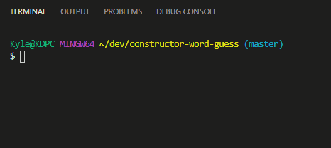
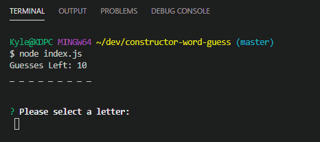

# constructor-word-guess

## How To Play:
The game works like any hangman or word guess game. The program will run a random word and the user must guess one letter at a time. The user has 10 chances to guess.

## Purpose:
This node application features the use of **inquirer** node package as well as **Constructor Functions**. The `Word.js` function takes in a random word from the array and runs that through the `Letter.js` function and maps each letter of the word into it's own array.

## Examples:

### Winning:

### Losing:

